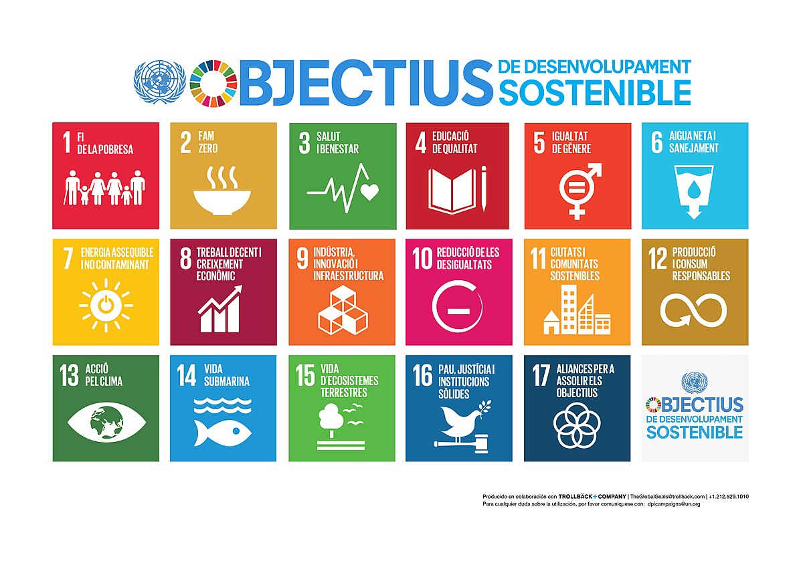

# Presentación de Contenido 1.2.1

## **Autor:**  
Jeremy Moncayo Padilla  

# 1.2.1 Selección de los ODS más relevantes y justificación.

El sector de la informática y las comunicaciones desempeña un papel crucial en la consecución de varios Objetivos de Desarrollo Sostenible (ODS). A continuación, se destacan los ODS más relevantes y su justificación:

## ODS 4: Educación de Calidad

- **Justificación**: Las tecnologías de la información y la comunicación (TIC) facilitan el acceso a recursos educativos en línea, permitiendo una educación más inclusiva y de calidad. Iniciativas como GIGA buscan conectar todas las escuelas del mundo a Internet, brindando oportunidades de aprendizaje a estudiantes globalmente. :contentReference[oaicite:0]{index=0}

## ODS 8: Trabajo Decente y Crecimiento Económico

- **Justificación**: El sector TIC impulsa la creación de empleo y fomenta el crecimiento económico a través de la innovación y la digitalización de procesos en diversas industrias.

## ODS 9: Industria, Innovación e Infraestructura

- **Justificación**: Las TIC son fundamentales para el desarrollo de infraestructuras resilientes y la promoción de la industrialización sostenible. La innovación tecnológica mejora la eficiencia y competitividad de las empresas.

## ODS 11: Ciudades y Comunidades Sostenibles

- **Justificación**: La implementación de soluciones inteligentes basadas en TIC contribuye a la creación de ciudades más sostenibles, mejorando la gestión de recursos y servicios urbanos.

## ODS 13: Acción por el Clima

- **Justificación**: La digitalización se considera una parte integral de la solución al cambio climático, ya que permite la monitorización y gestión eficiente de recursos, contribuyendo a la reducción de emisiones de gases de efecto invernadero. :contentReference[oaicite:1]{index=1}

- [Anterior Pagina](1.2_ODS_Moncayo.md)
- [Siguiente Pagina](1.2.2_ObjetivosODS_Moncayo.md)
- [Indice](../indice_pisa3_Grupo2_Moncayo.md)