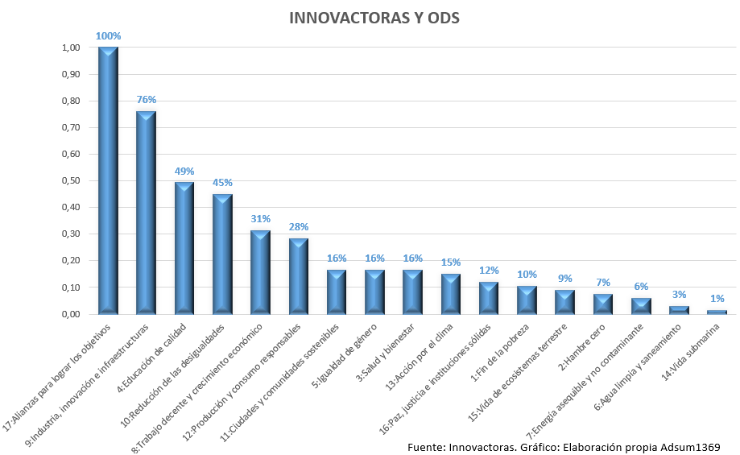

# Presentación de Contenido 1.2.1

## **Autor:**  
Jeremy Moncayo Padilla  

# 1.2.2 Objetivos y metas específicas de los ODS aplicables a Nuestro Sector Productivo.

## ODS 8: Trabajo Decente y Crecimiento Económico
**Objetivo:** Promover el crecimiento económico sostenido, inclusivo y sostenible, el empleo pleno y productivo, y el trabajo decente para todos.

### Metas específicas:
- 8.1: Mantener el crecimiento económico per cápita de acuerdo con las circunstancias nacionales.
- 8.2: Lograr niveles más elevados de productividad económica mediante la diversificación, la modernización tecnológica y la innovación.
- 8.3: Promover políticas orientadas al desarrollo que apoyen las actividades productivas, la creación de empleo decente, el emprendimiento y la innovación.
- 8.4: Mejorar progresivamente la eficiencia de los recursos mundiales en el consumo y la producción.
- 8.5: Lograr el empleo pleno y productivo y el trabajo decente para todos los hombres y mujeres, incluidos los jóvenes y las personas con discapacidad.
- 8.8: Proteger los derechos laborales y promover un entorno de trabajo seguro y sin riesgos para todos los trabajadores.

---

## ODS 9: Industria, Innovación e Infraestructura
**Objetivo:** Construir infraestructuras resilientes, promover la industrialización inclusiva y sostenible, y fomentar la innovación.

### Metas específicas:
- 9.1: Desarrollar infraestructuras fiables, sostenibles, resilientes y de calidad.
- 9.2: Promover una industrialización inclusiva y sostenible.
- 9.3: Aumentar el acceso de las pequeñas industrias y otras empresas a los servicios financieros.
- 9.4: Modernizar la infraestructura y reconvertir las industrias para que sean sostenibles.
- 9.5: Aumentar la investigación científica y mejorar la capacidad tecnológica de los sectores industriales.

---

## ODS 12: Producción y Consumo Responsables
**Objetivo:** Garantizar modalidades de consumo y producción sostenibles.

### Metas específicas:
- 12.2: Lograr la gestión sostenible y el uso eficiente de los recursos naturales.
- 12.4: Gestionar racionalmente los productos químicos y los desechos a lo largo de su ciclo de vida.
- 12.5: Reducir considerablemente la generación de desechos mediante actividades de prevención, reducción, reciclado y reutilización.
- 12.6: Alentar a las empresas a adoptar prácticas sostenibles e integrar información sobre la sostenibilidad en su ciclo de presentación de informes.
- 12.7: Promover prácticas de adquisición pública que sean sostenibles.

---

## ODS 13: Acción por el Clima
**Objetivo:** Adoptar medidas urgentes para combatir el cambio climático y sus efectos.

### Metas específicas:
- 13.1: Fortalecer la resiliencia y la capacidad de adaptación a los riesgos relacionados con el clima.
- 13.2: Incorporar medidas relativas al cambio climático en las políticas, estrategias y planificación nacionales.
- 13.3: Mejorar la educación, la sensibilización y la capacidad humana e institucional en relación con la mitigación del cambio climático.

---

## ODS 17: Alianzas para lograr los Objetivos
**Objetivo:** Fortalecer los medios de implementación y revitalizar la Alianza Mundial para el Desarrollo Sostenible.

### Metas específicas:
- 17.3: Movilizar recursos financieros adicionales para los países en desarrollo.
- 17.6: Mejorar la cooperación regional e internacional en materia de ciencia, tecnología e innovación.
- 17.11: Aumentar significativamente las exportaciones de los países en desarrollo.
- 17.17: Fomentar y promover la constitución de alianzas eficaces en las esferas pública, público-privada y de la sociedad civil.

---

Estos objetivos y metas son fundamentales para alinear las operaciones del sector productivo con los principios de sostenibilidad y responsabilidad social.

- [Anterior Pagina](1.2.1_ODS-Justificacion_Moncayo.md)
- [Indice](../indice_pisa3_Grupo2_Moncayo.md)