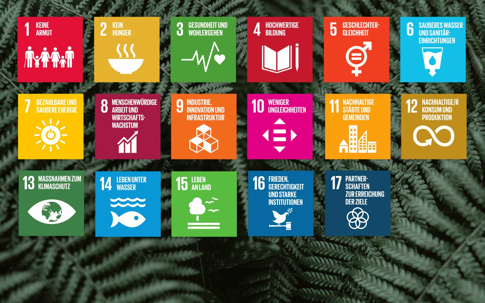

# Presentación de Contenido 1.2

## **Autor:**  
Jeremy Moncayo Padilla  

# 1.2 ODS más relevantes de Nuestro Sector Productivo.

El sector de la informática y las comunicaciones está estrechamente vinculado con varios **Objetivos de Desarrollo Sostenible (ODS)**, ya que la tecnología desempeña un papel clave en la transformación digital y la sostenibilidad.

## ODS Claves para el Sector TIC

### ODS 9: Industria, Innovación e Infraestructura  
- Promueve la construcción de **infraestructuras digitales resilientes**.  
- Impulsa la **innovación tecnológica** y el desarrollo de software.  
- Mejora la eficiencia y competitividad en diversas industrias mediante soluciones digitales.  

### ODS 4: Educación de Calidad  
- Facilita el acceso a **plataformas de aprendizaje en línea**.  
- Reduce la brecha digital y expande las oportunidades de formación.  
- Fomenta la capacitación en habilidades tecnológicas y digitales.  

### ODS 8: Trabajo Decente y Crecimiento Económico  
- Genera nuevos empleos en el sector tecnológico.  
- Promueve condiciones laborales dignas en el ámbito digital.  
- Impulsa la automatización y eficiencia en distintos sectores productivos.  

### ODS 11: Ciudades y Comunidades Sostenibles  
- Implementa **tecnologías inteligentes** para la gestión urbana.  
- Contribuye al desarrollo de **ciudades conectadas y eficientes**.  
- Optimiza el uso de la energía y el transporte a través de sistemas digitales.  

### ODS 13: Acción por el Clima  
- Apoya la monitorización y reducción de la huella de carbono.  
- Promueve el uso de **energías renovables en centros de datos**.  
- Fomenta la digitalización para reducir el consumo de papel y recursos físicos.  

- [Anterior Pagina](1.1_NuestroSectorProductivo_Moncayo.md)
- [Siguiente Pagina](1.2.1_ODS-Justificacion_Moncayo.md)
- [Indice](../indice_pisa3_Grupo2_Moncayo.md)