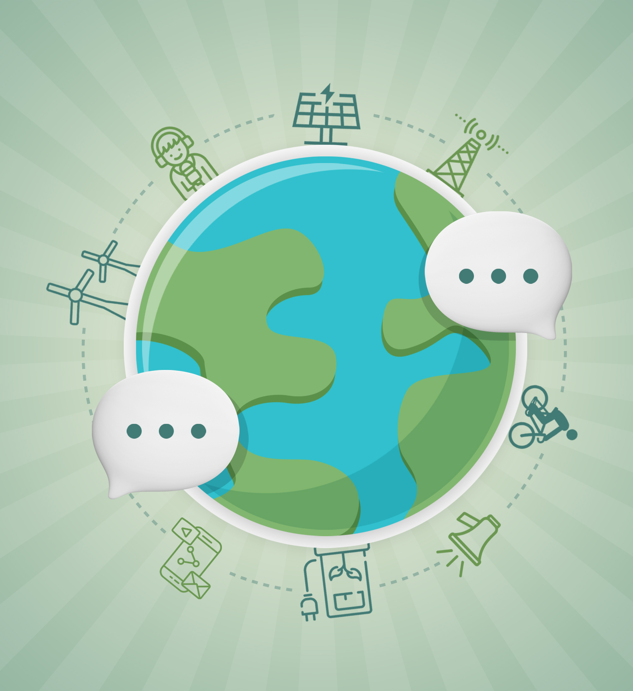

# Presentación de Contenido 1

## **Autor:**  
Jeremy Moncayo Padilla  


# 1. Identificación de los aspectos de sostenibilidad y ODS más relevantes en cada sector productivo.

Los 17 Objetivos de Desarrollo Sostenible (ODS) de la Agenda 2030 para el Desarrollo Sostenible— aprobada por los dirigentes mundiales en septiembre de 2015 en una cumbre histórica de las Naciones Unidas — entraron en vigor oficialmente el 1 de enero de 2016. Con estos nuevos Objetivos de aplicación universal, en los próximos 15 años los países intensificarán los esfuerzos para poner fin a la pobreza en todas sus formas, reducir la desigualdad y luchar contra el cambio climático garantizando, al mismo tiempo, que nadie se quede atrás.

Los ODS aprovechan el éxito de los Objetivos de Desarrollo del Milenio (ODM) y tratan de ir más allá para poner fin a la pobreza en todas sus formas. Los nuevos objetivos presentan la singularidad de instar a todos los países, ya sean ricos, pobres o de ingresos medianos, a adoptar medidas para promover la prosperidad al tiempo que protegen el planeta. Reconocen que las iniciativas para poner fin a la pobreza deben ir de la mano de estrategias que favorezcan el crecimiento económico y aborden una serie de necesidades sociales, entre las que cabe señalar la educación, la salud, la protección social y las oportunidades de empleo, a la vez que luchan contra el cambio climático y promueven la protección del medio ambiente.

A pesar de que los ODS no son jurídicamente obligatorios, se espera que los gobiernos los adopten como propios y establezcan marcos nacionales para el logro de los 17 objetivos. Los países tienen la responsabilidad primordial del seguimiento y examen de los progresos conseguidos en el cumplimiento de los objetivos, para lo cual será necesario recopilar datos de calidad, accesibles y oportunos. Las actividades regionales de seguimiento y examen se basarán en análisis llevados a cabo a nivel nacional y contribuirán al seguimiento y examen a nivel mundial.
```
- Objetivo 1: Fin de la Pobreza
- Objetivo 2: Hambre Cero
- Objetivo 3: Salud y Bienestar
- Objetivo 4: Educación de Calidad
- Objetivo 5: Igualdad de Género
- Objetivo 6: Agua Limpia y Saneamiento
- Objetivo 7: Energía Asequible y no Contaminante
- Objetivo 8: Trabajo Decente y Crecimiento Económico
- Objetivo 9: Industria, Innovación e Infraestructura
- Objetivo 10: Reducción de las Desigualdades
- Objetivo 11: Ciudades y Comunidades Sostenibles
- Objetivo 12: Producción y Consumo Responsables
- Objetivo 13: Acción por el Clima
- Objetivo 14: Vida Submarina
- Objetivo 15: Vida de Ecosistemas Terrestres
- Objetivo 16: Paz, Justicia e Instituciones Sólidas 
- Objetivo 17: Alianzas para Lograr los Objetivos
```
- 
- [Siguiente Pagina](1.1_NuestroSectorProductivo_Moncayo.md)
- [Indice](../indice_pisa3_Grupo2_Moncayo.md)